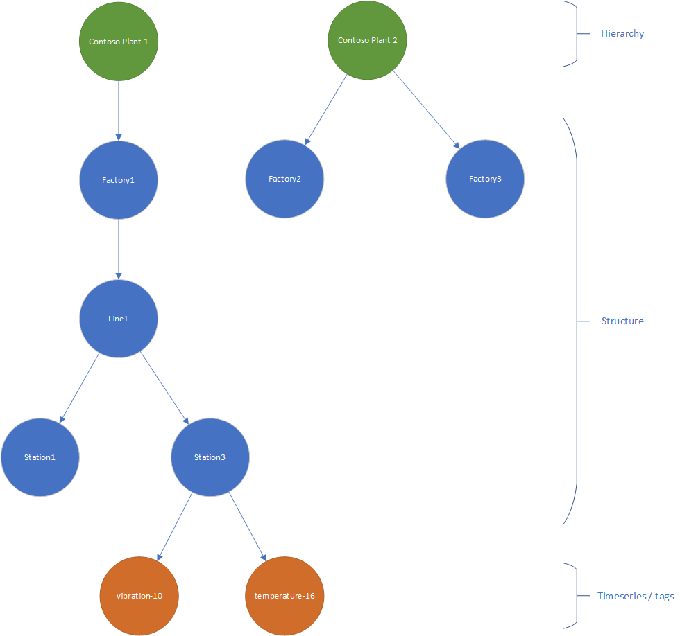

# KustoTrender: The Azure Data Explorer JavaScript SDK


<a href="https://kustotrender.z6.web.core.windows.net"></a>

The KustoTrender JavaScript SDK is a JavaScript library for Microsoft Azure Data Explorer, featuring components for data visualization and analytics, utilities for making calls directly to the KQL Cluster, and more.  **KustoTrender** also ships with an associated CSS file (which you must include using your preferred css linking method), which makes the components look great out of the box.


[](https://opensource.org/licenses/MIT) [](https://badge.fury.io/js/azure-kusto-trender) 

## Resources

* [API Reference documentation](docs/API.md)
* [Product documentation](https://learn.microsoft.com/en-us/azure/data-explorer/data-explorer-overview)
* [Hosted KustoTrender samples](https://kustotrender.z6.web.core.windows.net)

## Installing

If you use npm, `npm install azure-kusto-trender`.

To import all of **KustoTrender** into an ES2015 application, import everything into a namespace, like so:

```js
import KustoTrender from "azure-kusto-trender";

// later, when you want a line chart
let kustoTrender = new KustoTrender();
let lineChart = new kustoTrender.ux.LineChart(document.getElementById('chart'));
```

You can also import components individually.  If you only need the LineChart, you can import it like so...

```js
import LineChart from 'azure-kusto-trender/LineChart'

// later when you want a line chart
let lineChart = new LineChart(document.getElementById('chart'));
```
Importing individual components can help significantly reduce your bundle size as they work better with tree shaking. This is the recommended approach if your app only consumes specific components.

To import the kustotrender stylesheet into an ES2015 application, import either `kustoTrender.css` or `kustoTrender.min.css`, like so...

```js
import 'kustotrender/kustoTrender.css' // Standard styles
import 'kustotrender/kustoTrender.min.css' // Minified styles
```

## How to run Trender on your Kusto

A Kusto-Trender experience ([Example 1](/pages/examples/withplatform/exploreeventspayg.html), [Example 2](/pages/examples/withplatform/basiccharts.html)) relies on the following fundamental items:

* An Azure Active Directory App
* A Kusto cluster
* Schema & stored functions deployed on the cluster
* Optional: Sample data / data pipeline

This section covers the steps you need to take in order to run the Kusto-Trender on your Kusto environment.

1. [Create an Azure Application](#create-an-azure-application)
1. [Create a Kusto environment](#create-a-kusto-environment)
1. [Create the schema](#create-the-schema)
1. Optional: [Deploy sample data](#deploy-sample-data)
1. Optional: [Adapt to your data](#adapt-to-your-data--schema)

### Create an Azure Application

If your Trender needs to access Kusto using the credentials of the calling user, configure delegated permissions for your application registration. Please follow the following documentation:

1. [Create an Azure Active Directory application](https://learn.microsoft.com/azure/data-explorer/provision-azure-ad-app). It's not needed to create any certificate or secret.
1. [Configure delegated permissions for the application registration](https://learn.microsoft.com/azure/data-explorer/provision-azure-ad-app).
1. Optional: [grant admin consent](https://learn.microsoft.com/azure/active-directory/develop/v2-permissions-and-consent?WT.mc_id=Portal-Microsoft_AAD_RegisteredApps#admin-consent) for the permissions of the app you created.

### Create a Kusto environment

Kusto is available in many incarnations nowadays:

* [Azure Data Explorer](https://learn.microsoft.com/azure/data-explorer/data-explorer-overview)
* [Azure Synapse Data Explorer](https://learn.microsoft.com/azure/synapse-analytics/data-explorer/data-explorer-overview)
* [MyFreeCluster](https://aka.ms/kustofree)

All of them are compatible with Kusto Trender. The one that does not come with any cost is [MyFreeCluster](https://aka.ms/kustofree). You'll be able to create a new cluster for you in seconds.

### Create the schema

Once you have a working Kusto, you want to deploy the schema. You can find the schema that fuels the examples [here](kusto/trender-schema.kql). It's a small script which creates a couple of tables and functions. Just execute it in the scope of the database you like to use.

The following tables are created by the script.

#### Timeseries

The raw timeseries data. The TimeseriesId column represents an unique identifier for a timeseries (some call it "tag").

<!-- csl: https://help.kusto.windows.net/Trender -->
```kusto
Timeseries
| take 3
```

| TimeseriesId | Timestamp | Value |
|---|---|---|
| 939d52f1-cba7-48bb-87cb-d8e5d9050a73 | 2017-05-01 00:00:00.0000000 | 0,321766886722178 |
| 011523e8-5ab6-46ec-9a50-4ac3a6488f8c | 2017-05-01 00:00:00.0000000 | 0,00480370965876755 |
| bddbab16-fab5-4d59-8353-f35b58866e53 | 2017-05-01 00:00:00.0000000 | 0,84581159990962 |

#### TimeseriesMetadata

The metadata for the timeseries including name, description and other columns.

<!-- csl: https://help.kusto.windows.net/Trender -->
```kusto
TimeseriesMetadata
| take 3
```

| TimeseriesId | TimeseriesName | Description | EngUnits | DataStreamTags |
|---|---|---|---|---|
| 9fe3d2cc-6395-4f01-943a-64bcfafc2f90 | vibration-1 | A vibration sensor | Hz | []
| e8f32758-ad81-4471-8e4d-62eefa74f314 | vibration-2 | A vibration sensor | Hz | []
| 34994e72-205e-4288-a0e4-5b0a615f2c0d | vibration-3 | A vibration sensor | Hz | []

#### TimeseriesHierarchy

The hierarchy of the timeseries. In many scenarios the timeseries (aka tags) are organized in a hierarchy. The functions created in the last step allow browsing of that hierarchy. The Path is created as an array of path elements. The top level element is considered to be the name of the hierarchy. The remaining elements are considered to be the structural vertices of the hierarchy.



<!-- csl: https://help.kusto.windows.net/Trender -->
```kusto
TimeseriesHierarchy
| take 3
```

| TimeseriesId | DisplayName | Path |
|---|---|---|
| 687f97ef-268e-4daf-932c-181f793d0e59 | vibration-10 | [<br>&nbsp;"Contoso Plant 1",<br>&nbsp;"Factory1",<br>&nbsp;"Line1",<br>&nbsp;"Station3"<br>]|
| e1168559-15d5-4fc7-bf2c-4b773e4f8d1b | temp control rate-42 | [<br>&nbsp;"Contoso Plant 1",<br>&nbsp;"Factory1",<br>&nbsp;"Line1",<br>&nbsp;"Station3"<br>] |
| 283eebcb-d267-4a76-8179-a9b33fb87cf2 | temperature-16 | [<br>&nbsp;"Contoso Plant 1",<br>&nbsp;"Factory1",<br>&nbsp;"Line1",&nbsp;<br>"Station3"<br>] |

### Deploy sample data

In order to deploy the sample data you need to execute the [script](kusto/trender-sample-data.kql).

### Adapt to your data / schema

This section is relevant if you collect data and store it in a different schema then they one supported by the sample scenarios. There are multiple ways on how to proceed.

* You can create a lightweight ETL pipeline inside of Kusto using [Update Policies](https://learn.microsoft.com/azure/data-explorer/kusto/management/updatepolicy).
* A full blown ETL process before you ingest data into Kusto. There are tons of tools available.
* Instead of rolling out the schema in the samples you could create views ([stored functions](https://learn.microsoft.com/azure/data-explorer/kusto/query/schema-entities/views) without parameters) in Kusto which mimic the schema. The functions of the [schema ddl file](kusto/trender-schema.kql) would still work.

## Contributing

This project welcomes contributions and suggestions.  Most contributions require you to agree to a
Contributor License Agreement (CLA) declaring that you have the right to, and actually do, grant us
the rights to use your contribution. For details, visit https://cla.opensource.microsoft.com.

When you submit a pull request, a CLA bot will automatically determine whether you need to provide
a CLA and decorate the PR appropriately (e.g., status check, comment). Simply follow the instructions
provided by the bot. You will only need to do this once across all repos using our CLA.

This project has adopted the [Microsoft Open Source Code of Conduct](https://opensource.microsoft.com/codeofconduct/).
For more information see the [Code of Conduct FAQ](https://opensource.microsoft.com/codeofconduct/faq/) or
contact [opencode@microsoft.com](mailto:opencode@microsoft.com) with any additional questions or comments.

## Trademarks

This project may contain trademarks or logos for projects, products, or services. Authorized use of Microsoft 
trademarks or logos is subject to and must follow 
[Microsoft's Trademark & Brand Guidelines](https://www.microsoft.com/en-us/legal/intellectualproperty/trademarks/usage/general).
Use of Microsoft trademarks or logos in modified versions of this project must not cause confusion or imply Microsoft sponsorship.
Any use of third-party trademarks or logos are subject to those third-party's policies.
